# Ahmed T. Hammad

::: justify
Hello, my name is Ahmed. I hold a **PhD in Causal Machine Learning** and have over 10 years of [experience](https://athsas.com/cv/cv.html) working with data across academia and the private sector. My work sits at the boundary between econometrics and machine learning, where the question of what caused what matters more than what predicts what.

I am still actively involved in [research](https://athsas.com/research.html) and regularly [publish](https://athsas.com/papers.html) my work. I have published in PNAS, PLOS One, and Science of the Total Environment, with a focus on **causal inference, probabilistic modelling, and machine learning** applied to environmental data, public health, and policy evaluation.

In recent years I have also been working on **Financial Time Series, Environmental Data Modelling, Climate Change and Extreme Event Analysis**, with a strong emphasis on probabilistic models to assist both [private and public sector organisations](https://athsas.com/solutions.html).

One of the most fulfilling parts of my career is [**teaching**](https://athsas.com/teaching.html). Over four years at Le Wagon in Singapore, Bali, Malaysia, and Australia I have worked with over 200 students from all kinds of backgrounds. Helping people understand how to think with data, not just use it, is something I genuinely care about.

:::

\

### My fields of interest

::::: columns
::: {.column width="50%"}
-   Machine Learning
-   Econometrics
-   Extreme Events Analysis
-   Causal Inference
-   Algorithmic Trading
:::

::: {.column width="50%"}
-   Time Series
-   Probabilistic Models
-   Environmental Analysis
-   Sensor & Satellite Data
-   Prompt Engineering
:::
:::::

## Languages and Tools

::: logo-container
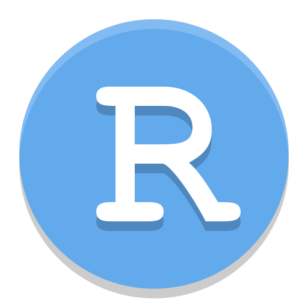 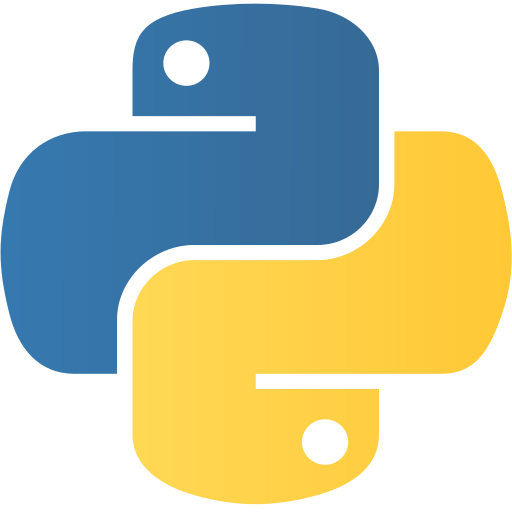 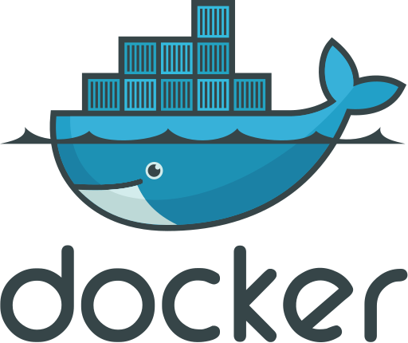 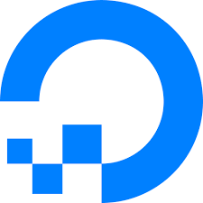 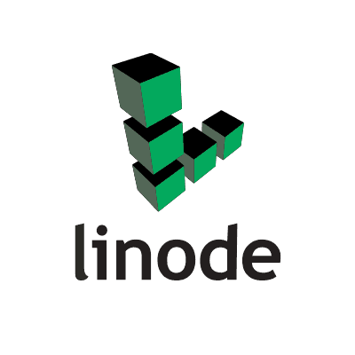  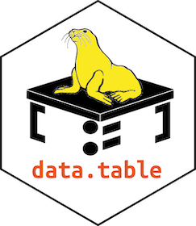 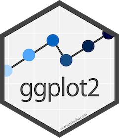 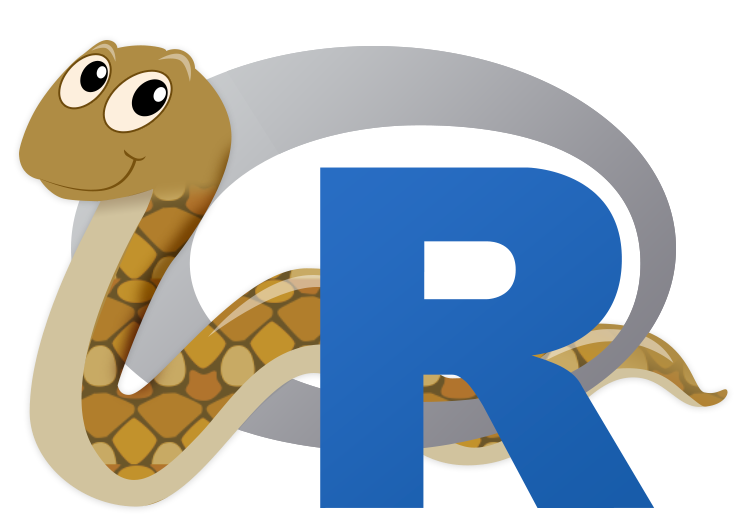 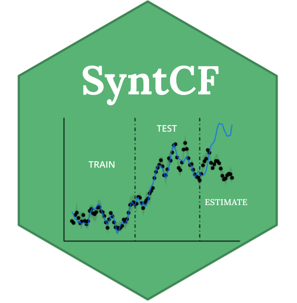 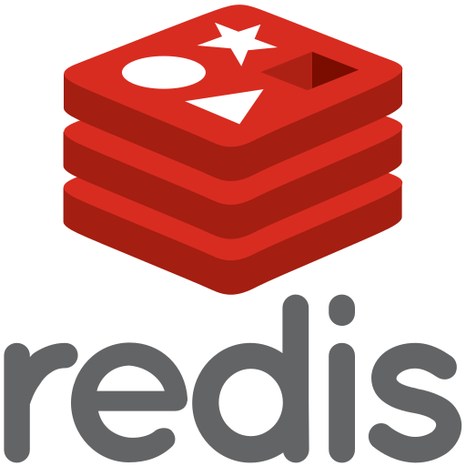 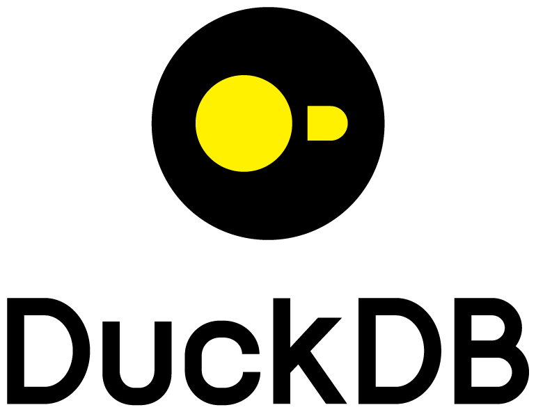 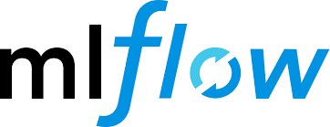 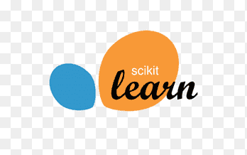 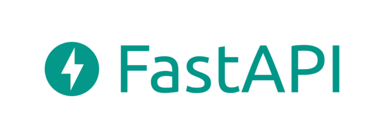  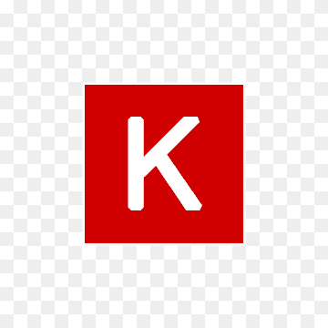 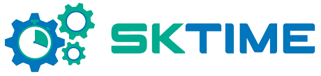 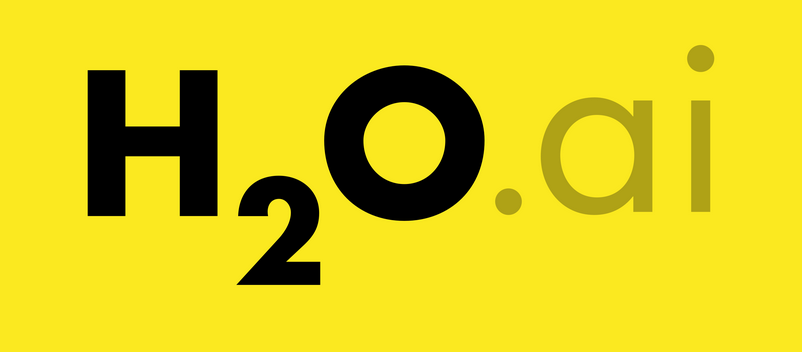 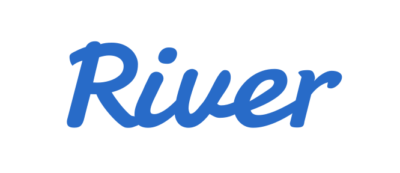 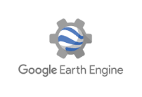    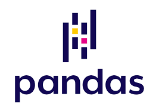  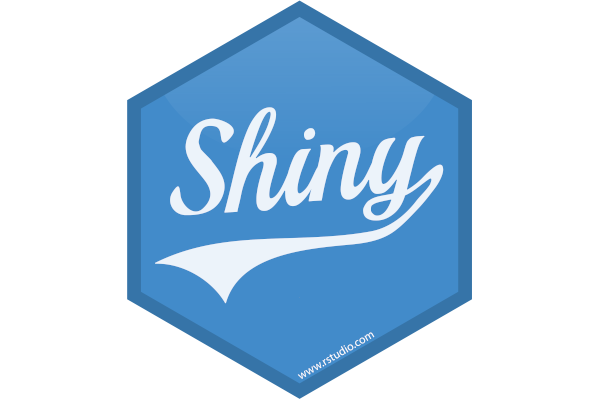   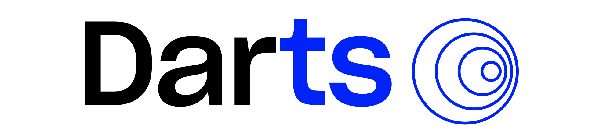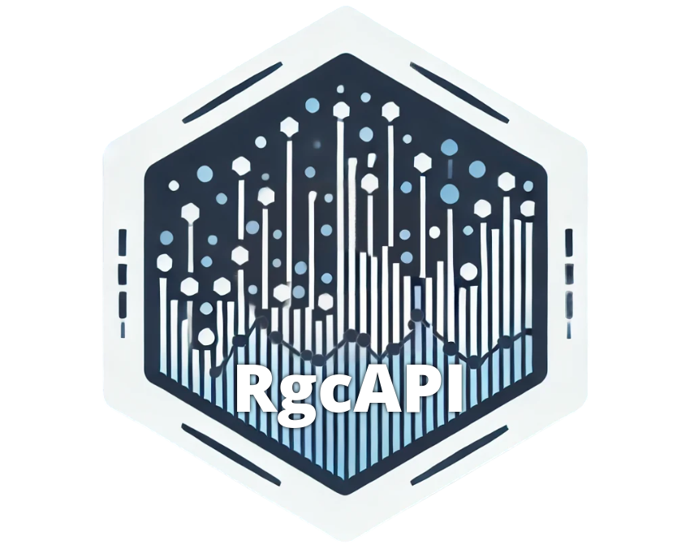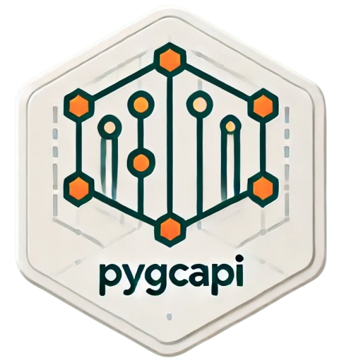
:::

------------------------------------------------------------------------

:::: justify
::: {style="font-size: 90%;"}
*For curious visitors, the name of the website is just a tentative to mix the initial letter of my full name and statistics. By chance, I ended up with something that has an actual meaning in Arabic 🤷.* **Athsas** *(أتحسس) means "to feel something" or a sensation given by an object or material when touched.*
:::
::::
