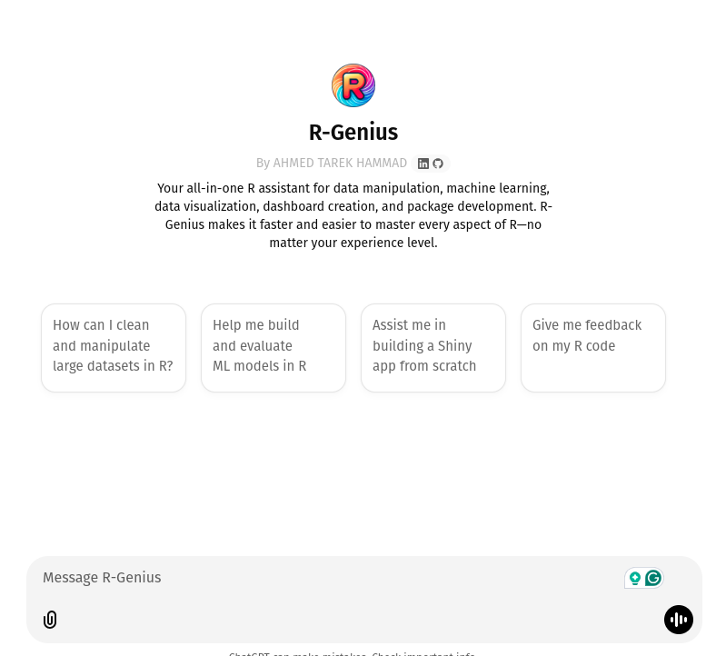

::: justify
R is one of the most powerful tools in data science. It's also one of the most unforgiving. Error messages that reveal nothing, package ecosystems that overlap in confusing ways, documentation that assumes you already know what you're looking for — it's a language that rewards persistence but punishes impatience.

I've been using R for years: for analysis, for building models, for creating visualizations, for writing packages, for Shiny apps. I know its quirks well enough that they no longer slow me down much. But I remember vividly when they did, and I see it regularly in the people I work with and teach. The gap between "knows enough R to be dangerous" and "fluent enough to move quickly" is wide, and most people spend a lot of time stuck in the middle.

That frustration — mine and others' — is what led me to build **R-Genius**.
:::

# The Inspiration Behind R-Genius

::: justify
The specific pain points I wanted to address were concrete: spending 20 minutes tracking down why a `dplyr` join produced unexpected rows, not knowing which of the five plotting libraries to reach for, getting lost in the sprawl of the tidymodels ecosystem. These aren't problems that require deep expertise to solve once you know the answer — but finding the answer is often slow and annoying.

I wanted to build something that could short-circuit that friction. Not a search engine, not a documentation browser, but something that could take a question in plain language and give back a specific, actionable answer tailored to what you're actually trying to do.
:::

# Bringing R-Genius to Life

::: justify
Building R-Genius meant deciding what it needed to know and how it should reason about R problems. I started from my own experience: what are the questions I get asked most often? What are the concepts that trip people up? What's the knowledge that's genuinely hard to discover on your own?

From there, I worked to cover the ecosystem systematically — not just the popular packages, but the specialized ones used in econometrics, time series, Bayesian analysis, spatial data. I paid particular attention to things that are well-known to be confusing: the difference between `tidyr::pivot_longer` and the old `gather`/`spread`, how R6 classes work, the idiosyncrasies of formula interfaces, how to actually debug a Shiny reactive loop.

The goal wasn't to replace documentation — it was to be more useful than documentation when you know *what* you're trying to do but not *how* to do it in R specifically.
:::

# How R-Genius Makes R More Accessible
::: justify
For beginners, the value is obvious: less time decoding error messages, faster path from question to working code. For more experienced users, it's more about speed — having the right function or idiom surfaced immediately rather than having to remember or look it up.

What I tried to get right was the *level* of explanation. Too shallow and it's not useful for understanding; too deep and it becomes a lecture when you just wanted an answer. I've tried to calibrate it to explain the "why" briefly alongside the "how," so you're not just copy-pasting code without knowing what it does.

It's designed to handle real tasks: cleaning a messy dataset, building a `ggplot2` visualization with a non-standard configuration, fitting and evaluating a model with `tidymodels`, writing a reproducible report in Quarto, publishing an R package. If you're working in R and stuck, it should be a useful first stop.
:::
# What R-Genius Can Do for You

::: justify
1. **Data manipulation**: from basic `dplyr` operations to advanced joins, reshaping, and data.table performance optimization.

2. **Machine learning**: model building, tuning, and evaluation across `tidymodels`, `caret`, and standalone packages.

3. **Visualization**: `ggplot2`, `plotly`, `ggraph`, and others — including the configuration details that always require documentation.

4. **Shiny apps**: from simple layouts to reactive logic debugging.

5. **Package development**: structure, documentation with `roxygen2`, testing with `testthat`, and CRAN submission.

6. **Specialized domains**: econometrics, time series, spatial analysis, Bayesian modeling.

Give it a try: [R-Genius](https://chatgpt.com/g/g-675f8eb65ce48191bdc6fb7034347661-r-genius). Feedback on gaps or things that could be better explained is always welcome.
:::
