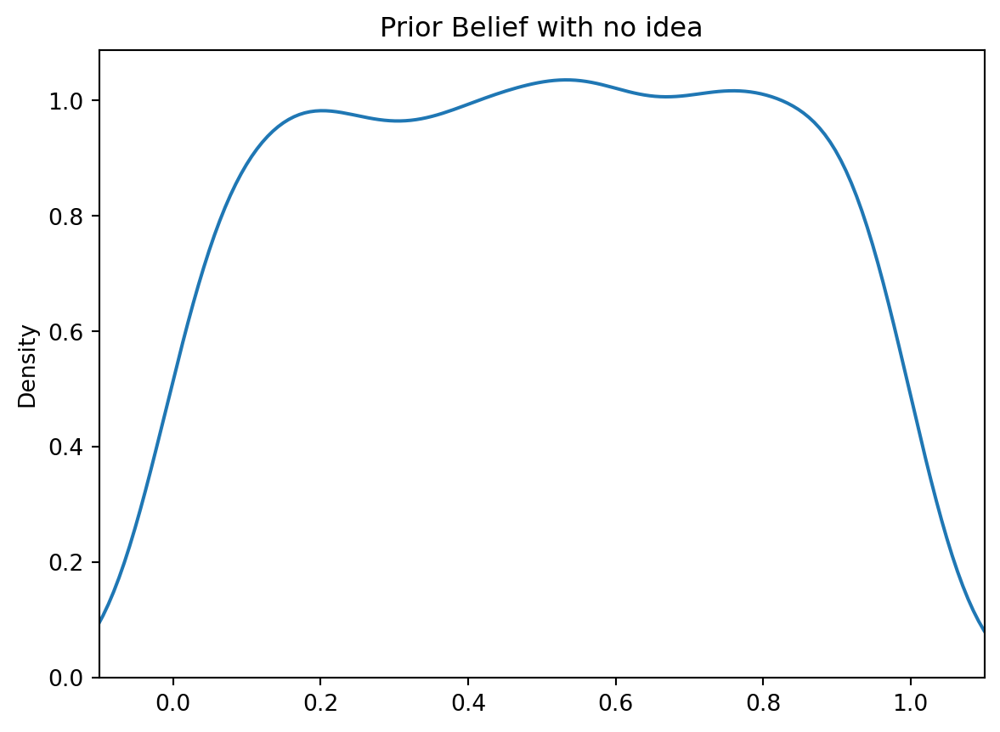
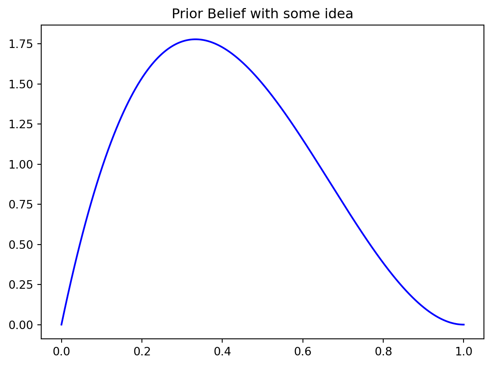
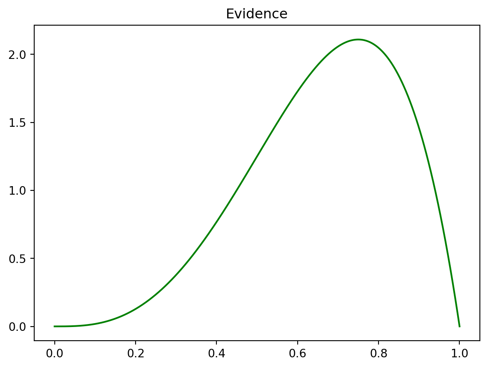
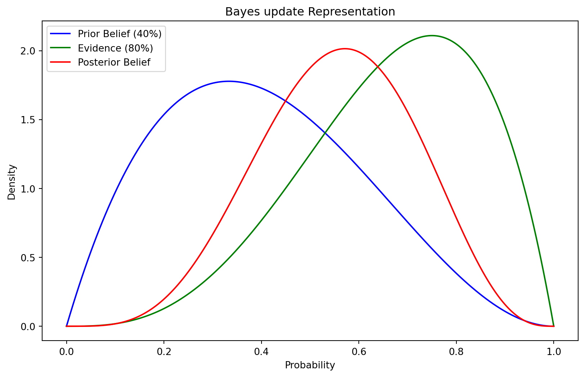
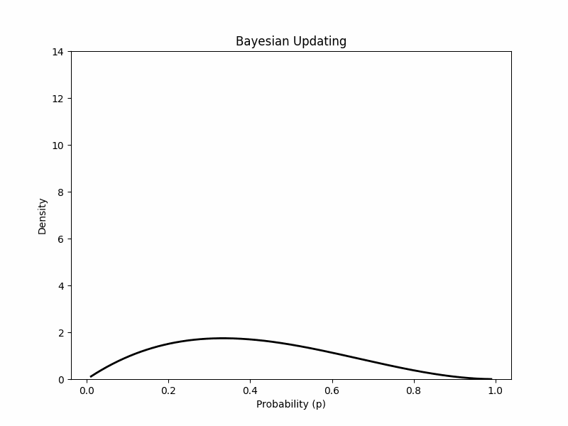

::: justify
# An intuitive explanation of Bayesian updating

I've explained Bayesian updating many times over the years — to students, to colleagues, to people with no statistics background at all. The examples I find work best are ones people have actually experienced: my dog, a first date, a job interview. This time, let's use the job interview.

## The job interview😎

You've landed an interview. You're excited and nervous. Standing outside the door, you genuinely don't know how it's going to go — whether you'll walk out with an offer or not. Both outcomes feel roughly equally possible.

In probability terms, you're starting with something close to a **uniform prior**: you don't have strong information either way, so you're distributing your belief fairly evenly across outcomes.

{fig-align="center"}

## Beliefs💬

But you don't always start completely neutral. Maybe you had a rough preliminary call with the company, and going in you feel less confident — maybe you'd say 40% chance this goes well. That 40% is still a prior belief, just a more specific one.

{fig-align="center"}

The key point is that this assessment is happening *before* you have new information — you're forming it at the door, before you've seen anything inside.

## Smile😁

You walk in. The first question comes. You answer well. The interviewer smiles — a confident, genuine smile. That's new information, and it changes things.

How much it changes things depends on how diagnostic you think a smile is. Let's say you're fairly optimistic about it: a smile like that probably means things are going well, so you'd assign it an 80% probability of a good outcome.

{fig-align="center"}

## Update🔀

Now Bayes' theorem does its work. You had a prior (40% confident going in), you observed evidence (a smile you'd assign 80%), and you combine them to get a posterior — your updated belief after seeing the evidence.

{fig-align="center"}

The posterior lands around 60%. You've updated upward from your prior, but not all the way to the evidence, because the prior was pulling the other way. The relative weights depend on how strong each is.

And this isn't a one-time thing. Every new piece of information — another question answered well, an awkward silence, the interviewers exchanging a look — becomes new evidence that updates the running posterior. The posterior from one update becomes the prior for the next.

{fig-align="center"}

That's the core of Bayesian reasoning: you start with a belief, you observe something, you update. You never throw away your prior — you just revise it in proportion to the evidence. Strong prior + weak evidence = small update. Weak prior + strong evidence = large update. Over time, with enough observations, the prior matters less and less, and the data dominates.

What I like about this framing is that it maps directly to how people actually reason. You're not waiting until all evidence is collected to form a view; you're constantly revising as things unfold. Bayes just makes that process precise.
:::

```{python, eval=FALSE, include=FALSE}
import numpy as np
import matplotlib.pyplot as plt
import seaborn as sns
import scipy.stats as stats

#make this example reproducible.
np.random.seed(1)
dataUni = np.random.uniform(size=1000)
sns.kdeplot(dataUni)
# Adjust x-axis limits to show the tails
plt.xlim(-0.1, 1.1)
plt.title('Prior Belief with no idea')
# Show the plot
#plt.show()
##########################################################
# Define the parameters for the prior belief and evidence
prior_prob = 0.4
# Create a range of values for the probability (x-axis)
x = np.linspace(0, 1, 1000)
# Calculate the prior probability distribution (prior belief)
prior_distribution = stats.beta.pdf(x, 2, 3)  # Beta distribution parameters (2, 3)
sns.lineplot(x=x, y=prior_distribution,color="blue")
plt.title('Prior Belief with some idea')
# Show the plot
#plt.show()

evidence_prob = 0.8
# Create a range of values for the probability (x-axis)
x = np.linspace(0, 1, 1000)

evidence_distribution = stats.beta.pdf(x, 4, 2)  # Beta distribution parameters (4, 2)
sns.lineplot(x=x, y=evidence_distribution, color='green')
plt.title('Evidence')
# Show the plot
#plt.show()

#########################################################

# Create a range of values for the probability (x-axis)
x = np.linspace(0, 1, 1000)

# Calculate the prior probability distribution (prior belief)
prior_distribution = stats.beta.pdf(x, 2, 3)  # Beta distribution parameters (2, 3)

# Calculate the evidence (as a Beta distribution with parameters based on evidence probability)
evidence_distribution = stats.beta.pdf(x, 4, 2)  # Beta distribution parameters (4, 2)

# Calculate the posterior probability distribution (updated belief)
posterior_distribution = prior_distribution * evidence_distribution

# Create a Seaborn plot
plt.figure(figsize=(10, 6))
sns.lineplot(x=x, y=prior_distribution, label='Prior Belief (40%)', color='blue')
sns.lineplot(x=x, y=evidence_distribution, label='Evidence (80%)', color='green')
sns.lineplot(x=x, y=posterior_distribution, label='Posterior Belief', color='red')

# Customize the plot
plt.title('Bayes update Representation')
plt.xlabel('Probability')
plt.ylabel('Density')
plt.legend()

#plt.show()

```
